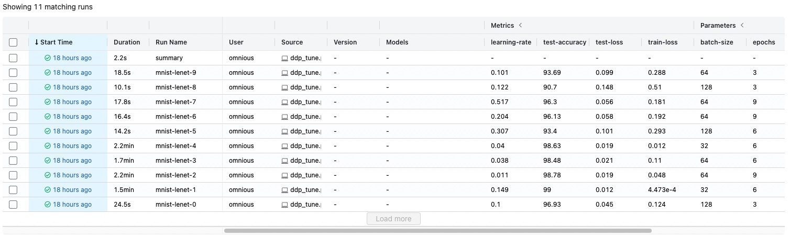
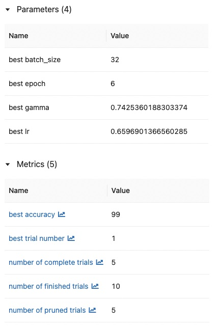
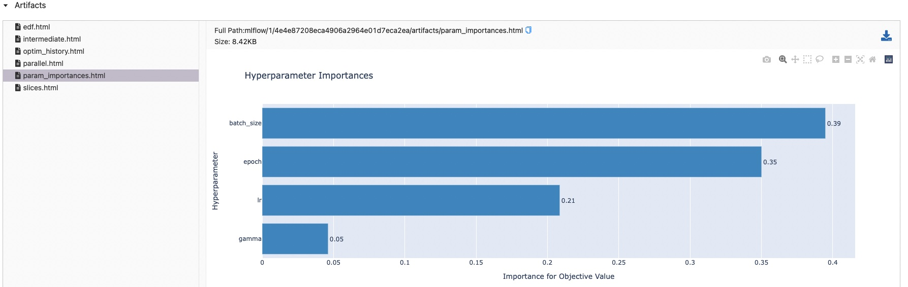

# OMNIOUS repository for ML projects

## Introduction

This repository contains an example program to train a deep neural network to classify
handwritten digits from the MNIST dataset.

In particular, it showcases the following points:

- MLflow to log the experiments and models.
- PyTorch DistributedDataParallel to run the model on multiple nodes.
- Optuna for automatic hyperparameter tuning.

## Setting up MLflow

Install Mlflow by issuing the following command

```bash
pip install mlflow
```

If you want to run a local instance of the MLflow server, we first create a directory where to
store the mlflow database, called `mlflow` in this example, and run it like this:

```bash
mkdir mlflow
mlflow server --backend-store-uri sqlite:///mlflow/dabase.sqlite --default-artifact-root mlflow/
```

Otherwise, just point at the MLflow address in the `main.py` file.

## Hyper-parameter tuning with Optuna

Install pre-requisites by issuing the following commands

```bash
pip install optuna
pip install plotly # optional for plot summary
```

## Launching the training program

This example uses PyTorch's DistributedDataParallel (DDP) for model parallelization across nodes.

In order to run this example, type:

```bash
torchrun --standalone --nproc_per_node=4 main.py
```

Then, connecto to the MLflow address (by default `localhost:5000`) and you should find an experiment
named `MNIST-PyTorch-Tune` on the left panel.

After selecting the experiment, all the runs should will appear there.

You can set the parameters for tuning by modifying the `get_hyperparams` function in `main.py`.
If you want to set a different number of tuning trials, run the code with the additional argument `--n-trials N`

Thanks to DDP, all experiments will run on multiple nodes, their results will be logged in the MLflow
dashboard, and Optuna will automatically find the best hyperparameters.
Note that Optuna will only run a trial to its completion if the starting point proves to be good, otherwise
it will stop the trial and start another one with different hyperparameters.

When all trials are done, a new run named summary will be created.
It contains the details about the hyperparameters that led to the best test accuracy.

It will also generate some nice-looking figures for easy visualization.



